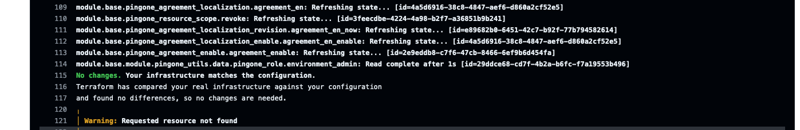
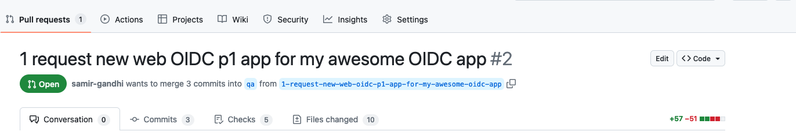

# Ping Application Example Pipeline

This repository is intended to present a simplified reference demonstrating how a management and deployment pipeline might work for applications that depend on services managed by a central IAM platform team. As such, it is a complement to the [infrastructure](https://github.com/pingidentity/pipeline-example-infrastructure) and [platform](https://github.com/pingidentity/pipeline-example-platform) example pipeline repositories.

> NOTE: This repository directly depends on a completed set-up of the [pipeline-example-application](https://github.com/pingidentity/pipeline-example-platform?tab=readme-ov-file#deploy-prod-and-qa). Please ensure you have completed the steps for confguration leading up to and including the previous link.

**Infrastructure** - Components dealing with deploying software onto self-managed Kubernetes infrastructure and any configuration that must be delivered directly via the filesystem.

**Platform** - Components dealing with deploying configuration to self-managed or hosted services that will be shared and leveraged by upstream applications.

**Application** - Delivery and configuration of a client application that relies on core services from Platform and Infrastructure.

The use cases and features shown in this repository are an implementation of the guidance provided from Ping Identity's [Terraform Best Practices](https://terraform.pingidentity.com/best-practices/) and [Getting Started with Configuration Promotion at Ping](https://terraform.pingidentity.com/getting-started/configuration-promotion/) documents.

In this repository, the processes and features shown in a GitOps process of developing and delivering a new application include:

- Feature Request Template
- Feature Development in an on-demand or persistent development environment
- Extracting feature configuration to be stored as code
- Validating the extracted configuration from the developer perspective
- Validating that the suggested configuration adheres to contribution guidelines
- Review process of suggested change
- Approval of change and automatic deployment into higher environments

## Prerequisites

To be successful in recreating the use cases supported by this pipeline, there are initial steps that should be completed prior to configuring this repository:

- Completion of all pre-requisites and confiuration steps leading to [Feature Development](https://github.com/pingidentity/pipeline-example-platform?tab=readme-ov-file#feature-development) in the example-pipeline-platform.

<!-- TODO - Review Required Permissions-->
> Note - For PingOne, meeting these requirements means you should have credentials for a worker app residing in the "Administrators" environment that has organization-level scoped roles. For DaVinci, you should have credentials for a user in a non-"Administrators" environment that is part of a group specifically intended to be used by command-line tools or APIs with environment-level scoped roles.

### Repository Setup

Click the **Use this template** button at the top right of this page to create your own repository.  After the repository is created, clone it to your local machine to continue.  The rest of this guide will assume you are working from the root of the cloned repository.

> Note - A pipeline will run and fail when the repository is created. This result is expected as the pipeline is attempting to deploy and the necessary configuration has not been performed.

## Development Lifecycle Diagram

The use cases in this repository follow a flow similar to this diagram:


## Before You Start

There are a few items to configure before you can use this repository effectively.

### Github Actions Secrets

The Github pipeline actions will depend on sourcing some secrets as ephemeral environment variables. To prepare the secrets in the repository:

```bash
cp secretstemplate localsecrets
```

> Note, `secretstemplate` is intended to be a template file, `localsecrets` is a file that contains credentials but is part of .gitignore and should never be committed into the repository. **`secretstemplate`** is committed to the repository, do not edit it directly!

Fill in `localsecrets` accordingly. The configurations in this repository rely on environments created from [pipeline-example-platform](https://github.com/pingidentity/pipeline-example-platform). For the `PINGONE_TARGET_ENVIRONMENT_ID_PROD` and `PINGONE_TARGET_ENVIRONMENT_ID_QA` variables, get the Environment ID for the `prod` and `qa` environments. The Environment ID can be found from the output at the end of a terraform apply (whether from the Github Actions pipeline, or local) or from the PingOne console directly.

If you have not created a dev environment in your PingOne account, you can do so by running the following command to instantiate one matching prod and qa:

```bash
git checkout prod
git pull origin prod
git checkout -b dev
git push origin dev
```

For customer and workforce application development and onboarding, set up another persistent environment named `dev` using the platform repository. Enter the corresponding Environment ID into localsecrets in your application repository for `PINGONE_TARGET_ENVIRONMENT_ID_DEV`. This action will leave you with three persistent environments `prod`, `qa` and `dev`, each with a corresponding environment variable definition pair in the `localsecrets` file.


Run the following command to upload **localsecrets** to Github:

```bash
_secrets="$(base64 -i localsecrets)"
gh secret set --app actions TERRAFORM_ENV_BASE64 --body $_secrets
unset _secrets
```

> Note - On a Mac, if you have installed the **base64** application using brew, there will be a file content failure in the pipeline stemming from the first command shown above.  Use the default version of base64 by specifying the path explicitly: `_secrets="$(/usr/bin/base64 -i localsecrets)"`

### Deploy Prod and QA

The final step before creating new features is to deploy application configuration for `prod` and `qa`.

Under the **Actions** section in Github, locate the failed **Initial commit** workflow run from the creation of the repository.  Click "Re-run jobs" and choose "Re-run all jobs". If your secrets are configured correctly, this should result in the successful deployment of a new environment named "prod" in your PingOne account.


To deploy the `qa` environment, simply create and push a new branch from prod with the name `qa`:

```bash
git checkout prod
git pull origin prod
git checkout -b qa
git push origin qa
```


## Feature Development

Now that the repository and pipeline are configured, the standard git flow can be followed. To experience the developer's perspective, the following steps will revolve around the use case of adding a new OIDC web application configuration into the PingOne production environment.

1. Create a GitHub Issue for a new feature request via the UI. GitHub Issue Templates help ensure the requestor provides appropriate information on the issue. Note: The GitHub issue name will be used to create the PingOne environment.


2. Click "Create a branch" and choose "Checkout Locally" for GitHub to create a development branch and PingOne environment on your behalf.


3. After the Github Actions pipeline completes, log in to your PingOne account with a user that has appropriate roles. This user may be the organization administrator with which you signed up for the trial or a development user if you have configured roles for it. The corresponding dev environment should now have additional application and DaVinci configuration.

4. Build the requested configuration by navigating into the environment: **Applications** > **Applications** > Click the blue **+** and provide the information:

- Application Name: my-awesome-oidc-web-app
- Application Type: OIDC Web App

5. Click **Save** and toggle the **Enable** switch. On the screen where the application is enabled, the **Environment ID** and application **Client ID** will also be shown. Capture these for use in the import process.

6. Typically the next step would be to provide the application details to the developer team for testing. This process is skipped in here for brevity.

7. After the application creation is "tested" manually, the new configuration must be added to the Terraform configuration. This addition will happen in a few steps, starting with creating and testing the configuration in the `./terraform/dev` folder.

  a. Terraform provides a [tool to help generate configuration](https://developer.hashicorp.com/terraform/language/import) for resources built directly in the environment. To leverage this tool as a developer, an import block will be added to `./terraform/dev/imports.tf`. Create this file now, adding lines similar to the following: 

```hcl
import {
  to = pingone_application.my_awesome_oidc_web_app
  id = "environment_id/client_id"
}
```

> Note: This file is not intended to be committed to Github and is included in **.gitignore**. To understand the values to be provided in the id attribute of any resource, the developer should refer to that resources documentation on registry.terraform.io.

  b. Run the generate command to generate output. In this repo, the generate command is wrapped in the deploy script:

```bash
./scripts/local_feature_deploy.sh --generate
```
> WARNING! Be sure you have updated the **local_feature_deploy.sh** script to include the correct values for the **bucket_name** and **region** variables.

This command will create a file with the generated output at `./terraform/dev/generated-platform.tf`

However, the command line should have also returned an error similar to the following:

```log
Planning failed. Terraform encountered an error while generating this plan.

╷
│ Error: expected refresh_token_duration to be in the range (60 - 2147483647), got 0
│ 
│   with pingone_application.my_awesome_oidc_web_app,
│   on generated-platform.tf line 22:
│   (source code not available)
│ 
╵
╷
│ Error: expected refresh_token_rolling_duration to be in the range (60 - 2147483647), got 0
│ 
│   with pingone_application.my_awesome_oidc_web_app,
│   on generated-platform.tf line 23:
│   (source code not available)
```

Terraform's import feature may frequently return errors due to complications with resource schemas. When this occurs the developer is typically able to correct the issue by reading the error.

  c. To resolve the error, two attributes in the generated configuration must be updated:

```yaml
    refresh_token_duration                             = 0
    refresh_token_rolling_duration                     = 0
```

becomes

```yaml
    refresh_token_duration                             = 60
    refresh_token_rolling_duration                     = 60
```

  d. After correcting the generated configuration, run the script again to import the resource into terraform's managed state:

```bash
./scripts/local_feature_deploy.sh   

Initializing the backend...
Initializing modules...
... trimmed extra lines ...

            support_unsigned_request_object                    = false
            token_endpoint_authn_method                        = "CLIENT_SECRET_BASIC"
            type                                               = "WEB_APP"
        }
    }

Plan: 1 to import, 0 to add, 1 to change, 0 to destroy.

Do you want to perform these actions?
  Terraform will perform the actions described above.
  Only 'yes' will be accepted to approve.
```

  e. Accept the plan by typing **yes** and allow it to complete. When finished, the deploy script can be run again to confirm there are no missed changes and signal that this configuration is ready to move into the base module.

8. Copy the new configuration into the base module at `/terraform/pingone_platform.tf`. Note, because this configuration is general for each environment, the **environment_id** attribute must be updated accordingly. The final new resource should look similar to:

```hcl
resource "pingone_application" "my_awesome_oidc_web_app" {
  access_control_role_type = null
  description              = null
  enabled                  = true
  environment_id           = pingone_environment.target_environment.id
  hidden_from_app_portal   = false
  login_page_url           = null
  name                     = "my awesome oidc web app"
  tags                     = []
  oidc_options {
    additional_refresh_token_replay_protection_enabled = true
    allow_wildcards_in_redirect_uris                   = false
    grant_types                                        = ["AUTHORIZATION_CODE"]
    home_page_url                                      = null
    initiate_login_uri                                 = null
    jwks                                               = null
    jwks_url                                           = null
    par_requirement                                    = "OPTIONAL"
    par_timeout                                        = 60
    pkce_enforcement                                   = "OPTIONAL"
    post_logout_redirect_uris                          = []
    redirect_uris                                      = []
    refresh_token_duration                             = 60
    refresh_token_rolling_duration                     = 60
    refresh_token_rolling_grace_period_duration        = 0
    require_signed_request_object                      = false
    response_types                                     = ["CODE"]
    support_unsigned_request_object                    = false
    target_link_uri                                    = null
    token_endpoint_authn_method                        = "CLIENT_SECRET_BASIC"
    type                                               = "WEB_APP"
  }
}
```

9. A `git status` command should show the file changed with your new configuration:

```bash
git status                       
On branch 1-request-new-web-oidc-p1-app-for-my-awesome-oidc-app
Your branch is ahead of 'origin/1-request-new-web-oidc-p1-app-for-my-awesome-oidc-app' by 1 commit.
  (use "git push" to publish your local commits)

Changes not staged for commit:
  (use "git add <file>..." to update what will be committed)
  (use "git restore <file>..." to discard changes in working directory)
        modified:   terraform/pingone_platform.tf

no changes added to commit (use "git add" and/or "git commit -a")
```

10. Before committing and pushing changes to GitHub, it is important to run the local development validations to ensure the proposed configuration meets the defined standards. In this case, those validates are called via `make devcheck`:

```bash
make devcheck
==> Formatting Terraform code with terraform fmt...
==> Checking Terraform code with terraform fmt...
==> Validating Terraform code with terraform validate...
Success! The configuration is valid.

==> Checking Terraform code with tflint...
==> Checking Terraform code with trivy...
2024-04-10T00:34:09.630-0600    INFO    Misconfiguration scanning is enabled
2024-04-10T00:34:13.544-0600    INFO    Detected config files: 7
```

11. Now that the configuration is completely ready, perform the typical file management cycle: *git add*, *git commit*, and *git push* the changes to GitHub. This push to GitHub will trigger the "Feature Deploy Push" action. However, if you inspect the `Deploy` step, there should be no change needed because your local environment is using the same remote backend terraform state as the pipeline, so the pushed change to the feature branch matches what was created by running the local deploy script.



> Note - From this point forward, the configuration deployment should not include any more manual changes in the UI of higher environments. PingOne Administrators or Developers may have access to the UI, but it should be for reviewing, not making, changes.

12. Open a Pull request for the feature branch to be merged into the **qa** branch. This pull request will trigger an action that runs validations similar to what occured in `make devcheck` as well as an important `terraform plan` command. The result of the terraform plan is what the reviewer of the pull request should focus on. In this case, the plan should show one new resource would be created if the pull request is merged.



13. When satisfied with the code review, merge the pull request into the **qa** branch. This merge triggers an action that will deploy the new change.

14. Finally, to get the feature into the production environment, the same pull request, review, and merge process will occur. The only difference in this situation is merging the **qa** branch into the **prod** branch.

15. After the merge to prod finishes and is the issue is considered complete, the GitHub isssue can be closed and the development branch can be deleted. When the development branch is deleted, a GitHub Action will be triggered to delete the corresponding PingOne Environment leaving only the **qa** and **prod** environments relevant to this example.
