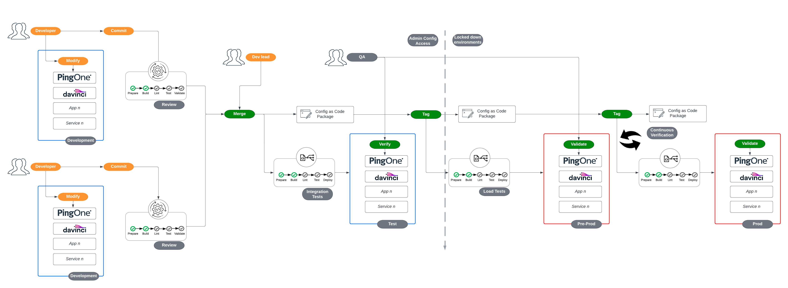

# Ping Application Example Pipeline 

This repository is intended to present a simplified reference demonstrating how a management and deployment pipeline might work for applications that depend on services managed by a central IAM platform team. As such, it is a complement to the [infrastructure](https://github.com/pingidentity/pipeline-example-infrastructure) and [platform](https://github.com/pingidentity/pipeline-example-platform) example pipeline repositories.

> NOTE: This repository directly depends on a completed set-up of the [pipeline-example-application](https://github.com/pingidentity/pipeline-example-platform?tab=readme-ov-file#deploy-prod-and-qa). Please ensure you have completed the steps for confguration leading up to and including the previous link.

**Infrastructure** - Components dealing with deploying software onto self-managed Kubernetes infrastructure and any configuration that must be delivered directly via the filesystem.

**Platform** - Components dealing with deploying configuration to self-managed or hosted services that will be shared and leveraged by upstream applications.

**Application** - Delivery and configuration of a client application that relies on core services from Platform and Infrastructure.

The use cases and features shown in this repository are an implementation of the guidance provided from Ping Identity's [Terraform Best Practices](https://terraform.pingidentity.com/best-practices/) and [Getting Started with Configuration Promotion at Ping](https://terraform.pingidentity.com/getting-started/configuration-promotion/) documents.

In this repository, the processes and features shown in a GitOps process of developing and delivering a new application include:

- Feature Request Template
- Feature Development in an on-demand or persistent development environment
- Extracting feature configuration to be stored as code
- Validating the extracted configuration from the developer perspective
- Validating that the suggested configuration adheres to contribution guidelines
- Review process of suggested change
- Approval of change and automatic deployment into higher environments

## Prerequisites

To be successful in recreating the use cases supported by this pipeline, there are initial steps that should be completed prior to configuring this repository:

- Completion of all pre-requisites and confiuration steps leading to [Feature Development](https://github.com/pingidentity/pipeline-example-platform?tab=readme-ov-file#feature-development) in the example-pipeline-platform.
- [Docker](https://docs.docker.com/engine/install/) - used to deploy a local sample application.

<!-- TODO - Review Required Permissions-->
> Note - For PingOne, meeting these requirements means you should have credentials for a worker app residing in the "Administrators" environment that has organization-level scoped roles. For DaVinci, you should have credentials for a user in a non-"Administrators" environment that is part of a group specifically intended to be used by command-line tools or APIs with environment-level scoped roles.

### Repository Setup

Click the **Use this template** button at the top right of this page to create your own repository.  After the repository is created, clone it to your local machine to continue.  The rest of this guide will assume you are working from the root of the cloned repository.

> Note - A pipeline will run and fail when the repository is created. This result is expected as the pipeline is attempting to deploy and the necessary configuration has not been performed.

## Development Lifecycle Diagram

The use cases in this repository follow a flow similar to this diagram:



## Before You Start

There are a few items to configure before you can use this repository effectively.

### Github Actions Secrets

The Github pipeline actions will depend on sourcing some secrets as ephemeral environment variables. To prepare the secrets in the repository:

```bash
cp secretstemplate localsecrets
```

> Note, `secretstemplate` is intended to be a template file, `localsecrets` is a file that contains credentials but is part of .gitignore and should never be committed into the repository. **`secretstemplate`** is committed to the repository, do not edit it directly!

Fill in `localsecrets` accordingly. The configurations in this repository rely on environments created from [pipeline-example-platform](https://github.com/pingidentity/pipeline-example-platform). For the `PINGONE_TARGET_ENVIRONMENT_ID_PROD` and `PINGONE_TARGET_ENVIRONMENT_ID_QA` variables, get the Environment ID for the `prod` and `qa` environments. The Environment ID can be found from the output at the end of a terraform apply (whether from the Github Actions pipeline, or local) or from the PingOne console directly.

If you have not created a static development environment in your PingOne account, you can do so in the *pipeline-example-platform* local repository by running the following command to instantiate one matching prod and qa:

```bash
git checkout prod
git pull origin prod
git checkout -b dev
git push origin dev
```

Enter the corresponding Environment ID into localsecrets in your application repository for `PINGONE_TARGET_ENVIRONMENT_ID_DEV`. This action will leave you with three persistent environments `prod`, `qa` and `dev`, each with a corresponding environment variable definition pair in the `localsecrets` file.


Run the following command to upload **localsecrets** to Github:

```bash
_secrets="$(base64 -i localsecrets)"
gh secret set --app actions TERRAFORM_ENV_BASE64 --body $_secrets
unset _secrets
```

> Note - On a Mac, if you have installed the **base64** application using brew, there will be a file content failure in the pipeline stemming from the first command shown above.  Use the default version of base64 by specifying the path explicitly: `_secrets="$(/usr/bin/base64 -i localsecrets)"`

### Deploy Prod and QA

The final step before creating new features is to deploy application configuration for `prod` and `qa`.

Under the **Actions** section in Github, locate the failed **Initial commit** workflow run from the creation of the repository.  Click "Re-run jobs" and choose "Re-run all jobs". If your secrets are configured correctly, this should result in the successful deployment of new configuration to the "prod" environment in your PingOne account.


To deploy the `qa` environment, simply create and push a new branch from prod with the name `qa`:

```bash
git checkout prod
git pull origin prod
git checkout -b qa
git push origin qa
```


## Feature Development
Now that the repository and pipeline are configured, the standard git flow can be followed. To experience the developer's perspective, follow steps similar to those documented within the [pipeline-example-platform "Feature Development"](https://github.com/pingidentity/pipeline-example-platform/tree/prod?tab=readme-ov-file#feature-development) section. A notable difference in this repository is that there will be no deployment of configuration to feature environments from the pipeline. Feature/Development envirionment configuration deployment will occur from local machines only. A "shared" application development environment will be used to connect to for deploying the applications managed in this repository.


To experience the developer's perspective, a demo walk through of the steps follows. The demo will simulated the use case of updating the client application and promoting the change into production.

1. In the **pipeline-example-platform** repository, create a GitHub Issue for a new feature request via the UI. Name the issue "application-development". This GitHub issue name will be used to create the PingOne environment.


2. Click "Create a branch" and choose "Checkout Locally" for GitHub to create a development branch and PingOne environment on your behalf.


3. The end of the Github Actions deploy step will output the environment id, capture it for use in this repository.

```
Apply complete! Resources: 15 added, 0 changed, 0 destroyed.

Outputs:

pingone_environment_id = "b1de511a-f8af-4c91-93da-79c212d7ed14"
```

4. In this **pipeline-example-application** repository, create a GitHub Issue for a new feature request via the UI. GitHub Issue Templates help ensure the requestor provides appropriate information on the issue.

5. Click "Create a branch" and choose "Checkout Locally" for GitHub to create a development branch and PingOne environment on your behalf. `cd` into the local root of this repository and enter the steps presented from "Checkout Locally". 

6. Run the deploy command to initialize the application

```bash
./scripts/local_feature_deploy.sh
```

Review the planned changes to see what will be deployed then enter "yes" to accept the plan.

7. There should now be an application running at http://localhost:8080. It will include a simple login screen, test the connection to PingOne by submitting an email and password. If the deployment is successful, a page will be returned showing that the user has been created in PingOne.

8. Next, edit the sample application code. A simple edit can be represented is updating the `<h1>` block with text `Welcome!` within `terraform/sample-app/index.html`.

9.  